  <!-- HERO BANNER -->
  

    

  <!-- TYPING BADGE / SLOGAN -->
  

  

    
    
    
  

  

## 🐍 Về Tôi • The Mystic Serpent

> *"Like a serpent gracefully navigating the shadows and shedding its old skin, I constantly refine, refactor, and evolve my craft to build robust and scalable systems."*

- 🔭 **Lĩnh vực trọng tâm**: Phát triển hệ thống Backend vững chắc với **Java** & **C#**, đồng thời tạo ra các ứng dụng **Web** trực quan, mượt mà.
- 🧪 **Dự án nổi bật**:
  - **[Labsys](https://github.com/Minh1210/Labsys)**: Nền tảng quản lý quy trình và tài sản phòng thí nghiệm (Java).
  - **[StudyShareApp](https://github.com/Minh1210/StudyShareApp)**: Ứng dụng kết nối chia sẻ học liệu và bài giảng (C# / .NET).
  - **[ielts-vocab-master](https://github.com/Minh1210/ielts-vocab-master)**: Công cụ luyện thi từ vựng IELTS tương tác thông minh (JavaScript).
- 🧬 **Triết lý làm việc**: Clean Architecture, Clean Code, bảo mật cao và tối ưu trải nghiệm người dùng cuối.
- ⚡ **Sở thích**: Giải mã các bài toán logic phức tạp, tối ưu database queries và thiết kế UI mang âm hưởng viễn tưởng (Sci-fi / Cyber-mystic).

 

  

## ⚡ Vũ Khí Công Nghệ • Tech Arsenal

| Nhóm kỹ năng | Công nghệ & Công cụ |
| :--- | :--- |
| **Ngôn ngữ cốt lõi** |      |
| **Frameworks & Nền tảng** |     |
| **Cơ sở dữ liệu & Lưu trữ** |    |
| **DevOps & Công cụ** |      |

 

  

## 🪐 Dự Án Tiêu Biểu • Featured Repositories

  <table>
    <tr>
      <td width="33%" valign="top" style="background:#0d061a; border: 1px solid #7c3aed; border-radius: 12px; padding: 15px;">
        <h3 align="center"><a href="https://github.com/Minh1210/Labsys">🧪 Labsys</a></h3>
        
<b>Hệ thống Quản lý Phòng Thí nghiệm</b>

        
Giải pháp quản trị cơ sở vật chất, mẫu xét nghiệm và thiết bị khoa học chính xác cao.

        

          
          
        

      </td>
      <td width="33%" valign="top" style="background:#0d061a; border: 1px solid #ec4899; border-radius: 12px; padding: 15px;">
        <h3 align="center"><a href="https://github.com/Minh1210/StudyShareApp">📚 StudyShareApp</a></h3>
        
<b>Ứng dụng Học tập & Chia sẻ</b>

        
Nền tảng chia sẻ tài liệu, bài giảng và hỗ trợ thảo luận nhóm hiệu quả cho sinh viên.

        

          
          
        

      </td>
      <td width="33%" valign="top" style="background:#0d061a; border: 1px solid #8b5cf6; border-radius: 12px; padding: 15px;">
        <h3 align="center"><a href="https://github.com/Minh1210/ielts-vocab-master">🎓 ielts-vocab-master</a></h3>
        
<b>Chinh phục Từ vựng IELTS</b>

        
Công cụ học từ vựng IELTS thông minh qua thẻ ghi nhớ (flashcard) và thuật toán nhắc lại ngắt quãng.

        

          
          
        

      </td>
    </tr>
  </table>

 

  

## 🐍 Game Rắn Ăn Commit • The Serpent's Trail

  
<i>Con rắn thần bò ăn lịch sử đóng góp code (commit graph) trên GitHub của Minh1210:</i>

  
  <picture>
    <source media="(prefers-color-scheme: dark)" srcset="https://raw.githubusercontent.com/Minh1210/Minh1210/output/github-contribution-grid-snake-dark.svg" />
    <source media="(prefers-color-scheme: light)" srcset="https://raw.githubusercontent.com/Minh1210/Minh1210/output/github-contribution-grid-snake.svg" />
    
  </picture>

 

  

## 📊 Thống Kê Hoạt Động • Cosmic Analytics

  
  &nbsp;&nbsp;
  

 

  

 

  

  

    ⚡ <i>"The future belongs to those who turn complex logic into captivating reality."</i> ⚡ 
    <b>© 2026 Nguyễn Văn Minh • Crafted with Cosmic Neon &amp; Serpent Spirit</b>
  

